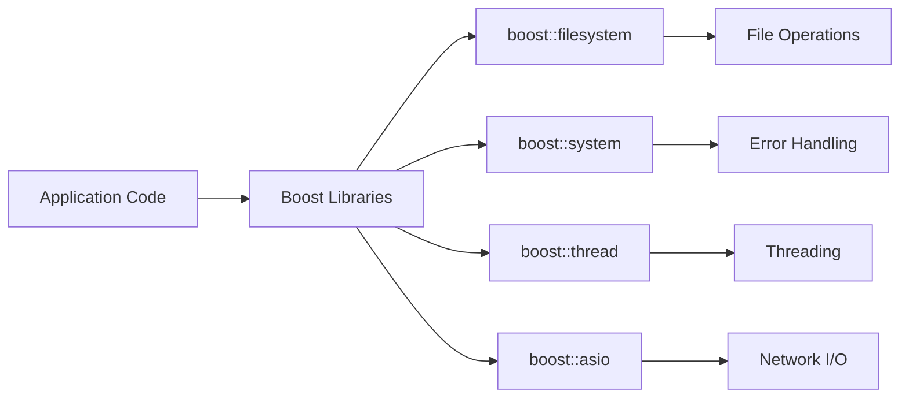
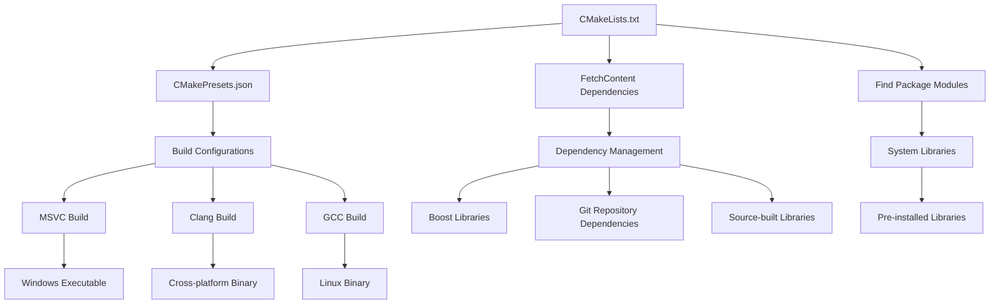
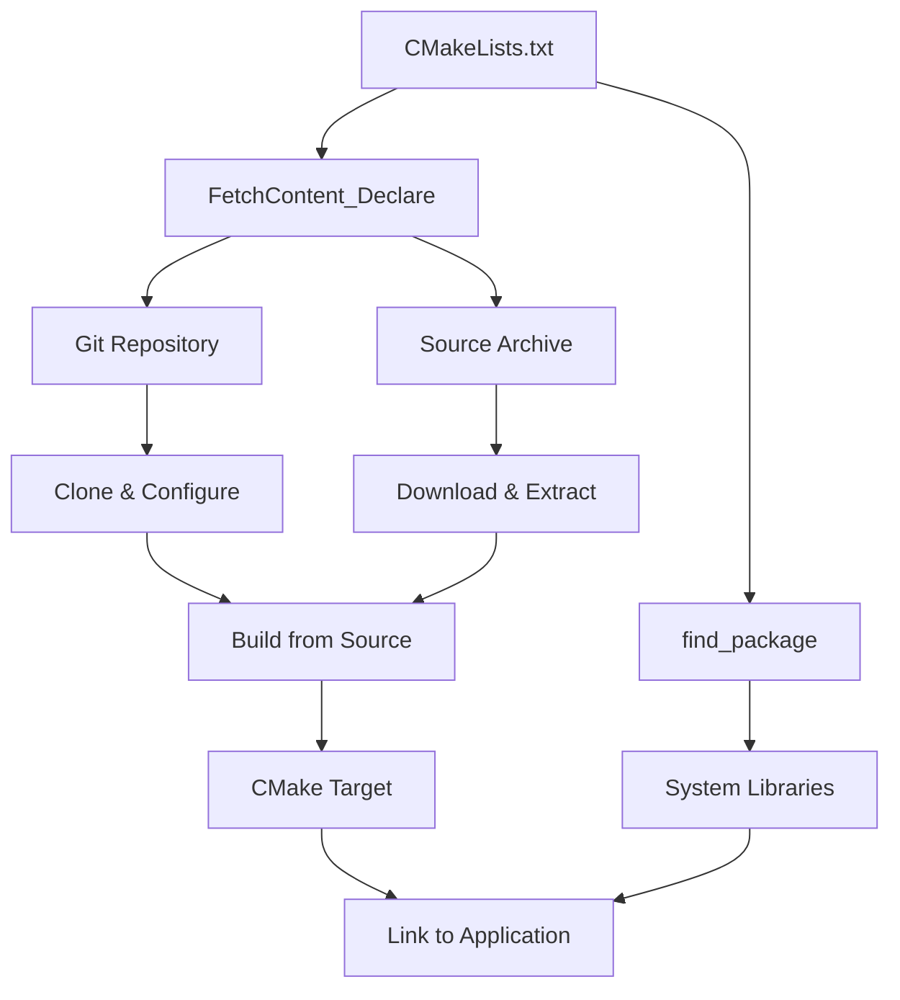
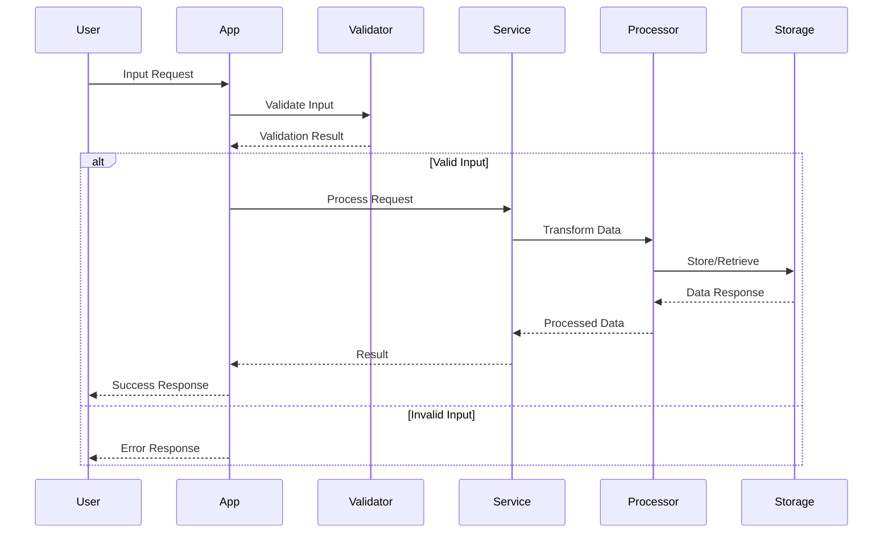
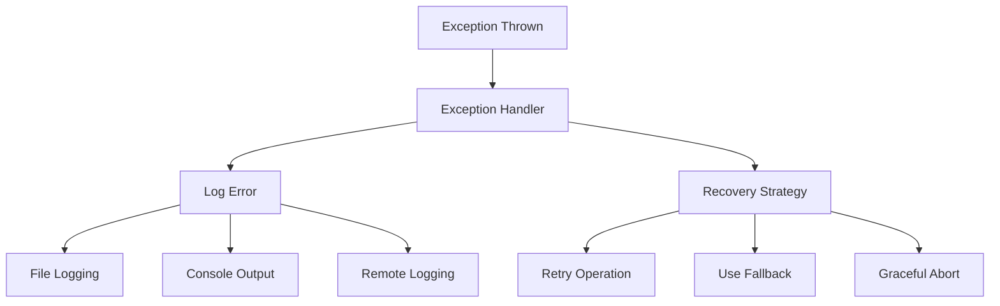
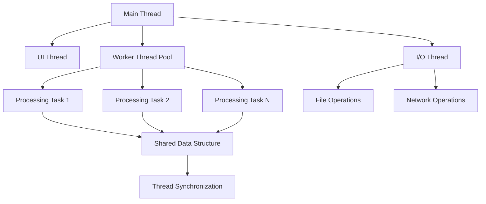

# System Architecture Diagram ✅ **PRODUCTION READY**

## High-Level System Overview ✅ **IMPLEMENTED**

```mermaid
graph TB
    subgraph "Electron Application"
        subgraph "Main Process"
            ElectronMain[Electron Main Process]
            BlueskyClient[@atproto/api Client]
            AuthService[Authentication Service]
            IPCHandlers[IPC Request Handlers]
        end
        subgraph "Preload Script"
            PreloadBridge[Preload Script]
            ContextAPI[Context Bridge API]
        end
        subgraph "Renderer Process (Sandboxed)"
            UI[User Interface: TypeScript + CSS]
            SearchUI[Search Interface]
            ProfileModal[Profile Modal System]
            LocalStorage[Username Persistence]
        end
    end
    subgraph "External Services"
        BlueskyAPI[Bluesky AT Protocol API]
    end

    ElectronMain --> BlueskyClient
    BlueskyClient --> BlueskyAPI
    AuthService --> BlueskyAPI
    IPCHandlers --> PreloadBridge
    PreloadBridge --> ContextAPI
    ContextAPI --> UI
    UI --> SearchUI
    UI --> ProfileModal
    UI --> LocalStorage

    UI -.->|IPC Invoke| IPCHandlers
    IPCHandlers -.->|Response| UI
```

## Component Responsibilities ✅ **ALL IMPLEMENTED**

### Main Process Layer ✅

- **✅ Electron Main Process**: Window management, lifecycle, security configuration
- **✅ Bluesky API Client**: Direct integration with @atproto/api v0.15.27 for all data operations
- **✅ Authentication Service**: Secure login handling, session management, credential validation
- **✅ IPC Request Handlers**: Secure communication bridge for login, search, and profile requests

### Security & Communication ✅

- **✅ Preload Script**: Safe API exposure via contextBridge with no Node.js access in renderer
- **✅ Context Bridge API**: Secure interface for login, search, getUserProfile, and status checking
- **✅ Process Isolation**: Complete separation between main process (API calls) and renderer (UI only)
- **✅ Content Security Policy**: Configured to allow HTTPS images while blocking inline scripts

### User Interface Layer ✅

- **✅ Modern UI System**: Responsive TypeScript + CSS interface with professional styling
- **✅ Search Interface**: Three filter modes (Combined, Profiles Only, Content Only) with intelligent result display
- **✅ Profile Modal System**: Interactive user profile viewer with recent posts and detailed information
- **✅ Username Persistence**: localStorage integration for remembering login credentials across sessions

## Technology Integration Points

### Boost Libraries Integration



### Build System Architecture



## Dependency Management Strategy

### FetchContent-Based Dependencies



### Dependency Resolution Order

1. **System-installed packages** via `find_package()`
2. **FetchContent for header-only libraries** (immediate availability)
3. **FetchContent for compiled libraries** (built as part of main build)
4. **Manual build fallback** for complex dependencies

## Data Flow Patterns

### Request Processing Flow



## Error Handling Strategy



## Threading Model


