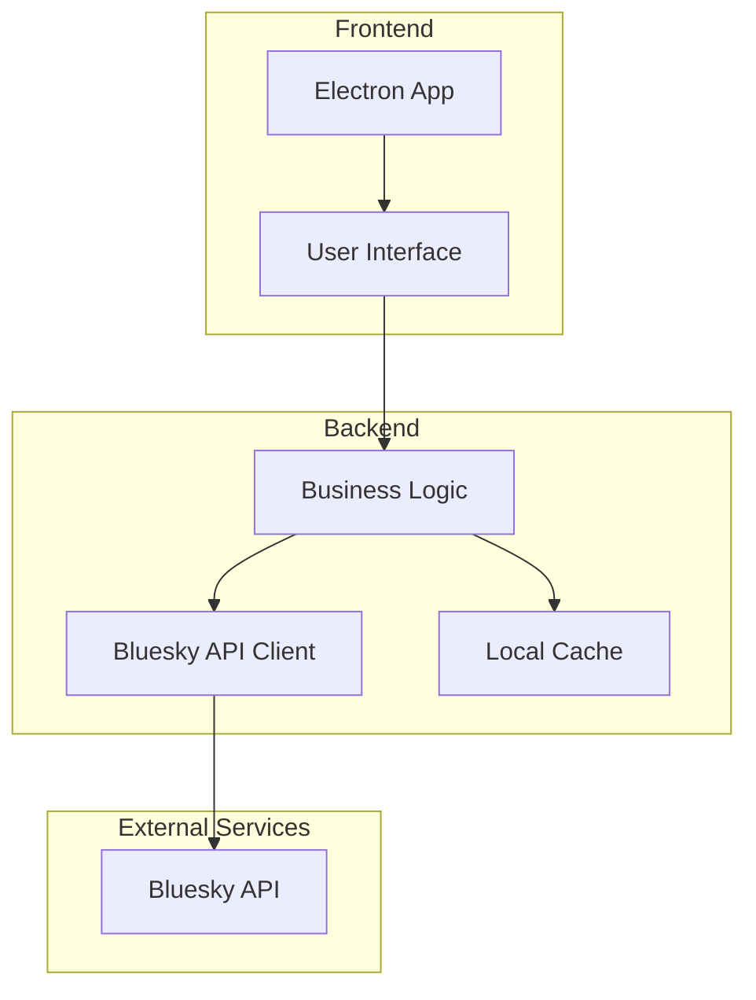

# Architecture Overview

## System Architecture

## Key Components

- **Electron App**: Hosts the UI, manages windows, and provides desktop integration
- **User Interface**: Built with TypeScript and modern CSS (no React yet), provides login, search, and follow features
- **Business Logic**: Handles login state, search, and user actions (in progress)
- **Bluesky API Client**: Will communicate with Bluesky’s AT Protocol endpoints (next step)
- **Local Cache**: Will store settings and recent data for performance

## Technology Stack

- **Frontend**: Electron, JavaScript/TypeScript, React (or similar)
- **API**: Bluesky AT Protocol
- **Platforms**: Windows, macOS, Linux
- **Data Storage**: Local storage (settings, cache)
- **Build System**: npm/yarn, Electron Builder

## Design Principles

1. **Modular UI**: Separate components for search, profile, and settings
2. **API Abstraction**: Encapsulate Bluesky API logic for maintainability
3. **Responsive Design**: Ensure usability across platforms and screen sizes
4. **Secure Storage**: Protect user credentials and sensitive data
