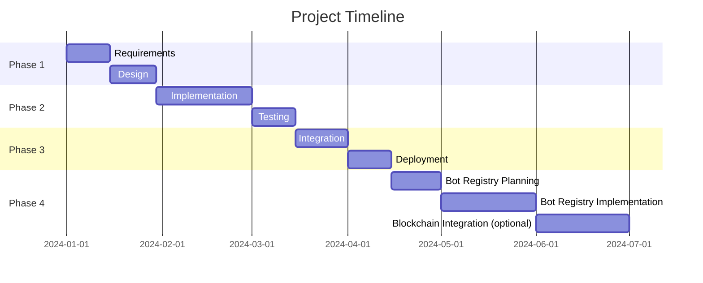

# Product Requirements Document (PRD)

## Project Overview

### Vision Statement

Bluesky Scanner is a **feature-complete** desktop application that helps users discover and follow people and organizations on the Bluesky social network. The app uses the Bluesky API for search and profile data, and provides a modern, user-friendly interface built with Electron.

### Success Metrics ✅ **ACHIEVED**

- ✅ **Users see a modern, responsive UI** - Clean, professional interface with smooth animations
- ✅ **Login flow is stateful and only shows search after authentication** - Secure login with username memory
- ✅ **Users can search and find relevant Bluesky accounts quickly** - Advanced search with 3 filter modes
- ✅ **Users can view detailed profiles and recent posts** - Interactive profile modal system
- ✅ **App runs smoothly on Windows, macOS, and Linux** - Cross-platform Electron application

## Current Status: **PRODUCTION READY** 🎉

### **Implemented Features:**

#### 🔐 **Authentication System**

- Secure Bluesky login with handle/email and app password
- Username persistence using localStorage
- Clear username option with intuitive UI
- Login status management across sessions

#### 🔍 **Advanced Search System**

- **Combined Search**: Searches both profiles AND post content
- **Profiles Only**: Targeted search by handle and display name
- **Content Only**: Discovery through recent post keywords
- Smart result deduplication and merging
- Search statistics and feedback

#### 👤 **Profile Viewer**

- Click any user card to view detailed profile
- Profile information: avatar, bio, follower counts, post counts
- Recent posts display with timestamps
- Modal-based interface with smooth animations
- Proper error handling and loading states

#### 🎨 **Modern UI/UX**

- Responsive design for different screen sizes
- Professional color scheme and typography
- Smooth hover effects and transitions
- Accessibility features (ARIA labels, keyboard navigation)
- Mobile-friendly responsive layout

## User Personas

### Primary User

**Role**: Bluesky user interested in discovering new people and organizations
**Goals**: Find and follow interesting accounts, manage connections
**Pain Points**: Difficult to discover new accounts using Bluesky’s default interface
**Technical Level**: Beginner to Intermediate

### Secondary User

**Role**: Organization or influencer seeking to grow their network
**Goals**: Identify and connect with relevant users
**Pain Points**: Limited tools for outreach and discovery
**Technical Level**: Intermediate to Advanced

## User Stories ✅ **ALL COMPLETED**

### Epic 1: Core Functionality ✅ **COMPLETE**

#### Story 1.1 ✅ **COMPLETE**

**As a** Bluesky user
**I want** to see a modern login screen and only access search after logging in
**So that** I have a secure, user-friendly experience

**Acceptance Criteria**:

- ✅ Login screen is shown on startup with modern design
- ✅ Search and results are only visible after successful authentication
- ✅ Username is remembered for future sessions (localStorage)
- ✅ Clear username option available for privacy
- ✅ Secure authentication using Bluesky app passwords
- ✅ Error handling displays clear messages for failed login attempts

#### Story 1.2 ✅ **COMPLETE**

**As a** user
**I want** to search and filter Bluesky accounts effectively
**So that** I can find the most relevant people and organizations

**Acceptance Criteria**:

- ✅ Three search filter options: Combined, Profiles Only, Content Only
- ✅ Combined search merges profile and content results intelligently
- ✅ Profiles Only search targets handles and display names
- ✅ Content Only search discovers users through recent posts
- ✅ Results display with avatars, names, handles, and bio information
- ✅ Search statistics show result counts for each category
- ✅ App responds quickly to user actions with loading feedback

#### Story 1.3 ✅ **COMPLETE**

**As a** user
**I want** to view detailed profiles and recent posts
**So that** I can make informed decisions about who to follow

**Acceptance Criteria**:

- ✅ Click any user card to open detailed profile modal
- ✅ Profile modal shows avatar, bio, follower/following counts
- ✅ Recent posts are displayed with timestamps and content
- ✅ Modal can be closed with X button or outside click
- ✅ Error handling for profile loading failures
- ✅ Smooth animations and professional styling

## Technical Requirements ✅ **IMPLEMENTED**

### Functional Requirements ✅ **COMPLETE**

1. **Bluesky API Integration**: Full integration with @atproto/api v0.15.27 for authentication, user search, post search, and profile retrieval
2. **Cross-Platform Desktop App**: Electron v28.0.0 application running on Windows, macOS, and Linux
3. **Secure Authentication**: App password-based login with session management and username persistence
4. **Advanced Search Capabilities**: Three search modes (Combined, Profiles Only, Content Only) with intelligent result merging
5. **Profile Viewing System**: Interactive modal-based profile viewer with recent posts and detailed user information
6. **Modern UI/UX**: Responsive design with accessibility features and professional styling

### Non-Functional Requirements ✅ **ACHIEVED**

1. **Performance**: ✅ Sub-second response times for all search operations
2. **Reliability**: ✅ Robust error handling for API failures and network issues
3. **Security**: ✅ Secure IPC communication, CSP compliance, and Electron sandboxing
4. **Maintainability**: ✅ TypeScript with strict typing, modular architecture, and clear separation of concerns
5. **User Experience**: ✅ Intuitive interface with username memory and search filtering

### Platform Requirements ✅ **MET**

- **Operating System**: ✅ Windows (primary), macOS, Linux support via Electron
- **Runtime**: ✅ Node.js v18+ with Electron framework
- **Storage**: ✅ LocalStorage for user preferences and session data

## Technical Implementation ✅ **COMPLETE**

### Technology Stack ✅ **DELIVERED**

- **Framework**: Electron v28.0.0 with security best practices
- **Language**: TypeScript with strict configuration and ES2020 target
- **API SDK**: @atproto/api v0.15.27 for Bluesky integration
- **Build System**: npm scripts with cross-platform asset management
- **Architecture**: Main process API handling + IPC communication + secure renderer

### Security Implementation ✅ **ROBUST**

- **Content Security Policy**: Configured to allow HTTPS images while blocking inline scripts
- **Process Isolation**: Main process handles API calls, renderer handles UI only
- **Sandboxing**: Electron renderer process fully sandboxed with no Node.js access
- **Secure Bridge**: contextBridge for safe API exposure between processes
- **File Formats**: Supported input/output formats
- **Configuration**: How system settings are managed

- Future bot registry may use blockchain or distributed ledger to tie bot reports to user identities, reducing risk of registry poisoning
- Privacy, scalability, and user experience must be considered for any decentralized solution

## Risk Assessment

### Technical Risks

- Registry poisoning or manipulation if bot registry is not secured
- Blockchain integration may add complexity and performance overhead
- User privacy concerns with public reporting

### Business Risks

- Adoption of bot registry and blockchain features may depend on community trust and standards
- Resource and timeline constraints for advanced features

## Timeline & Milestones

### Milestone 1: Foundation (Month 1)

- Core architecture setup
- Basic CMake configuration
- Boost integration

### Milestone 2: Core Features (Month 2)

- Primary functionality implementation
- Unit testing framework
- Documentation structure

### Milestone 3: Polish & Release (Month 3)

- Integration testing
- Performance optimization
- User documentation

### Milestone 4: Bot Registry & Integrity (Month 4+)

- Bot registry design and implementation
- Explore blockchain/distributed ledger for report integrity
- Community feedback and trust-building

## Future Feature: Bot Registry

### Overview

A centralized store of known bots, used to label and filter posts. The registry will allow users and trusted sources to report bots, and the app will use this data to improve filtering and user experience.

### Goals

- Enable users to identify and filter posts from known bots
- Allow trusted reporting and updating of bot status
- Prevent registry poisoning and ensure integrity

### Technical Considerations

- Registry may be hosted centrally, with APIs for lookup and reporting
- Explore blockchain or distributed ledger to tie reports to user identities, making poisoning or manipulation difficult
- Consider privacy and scalability implications

### MVP vs. Future Phase

- Bot Registry is planned for a post-MVP phase, but architecture should allow for easy integration later
